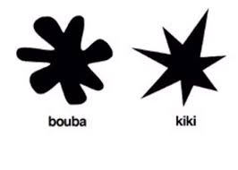

> 본 포스팅은 2025 Co-Week Academy 참여 후 강의 내용을 정리한 글입니다.

# 다중모달 데이터를 활용한 딥러닝

## 다중 모달 AI란?

### Modality
- 정보를 수집하거나 표현하는 방식 (예: 이미지, 텍스트, 오디오, 센서 데이터 등)

### Multi-modality
- 서로 다른 모달리티로 표현된 정보의 집합

### Multi-Modality AI
- 다양한 형태의 데이터를 통합적으로 이해·처리하는 인공지능
- 멀티모달 데이터와 정보
    - 센서의 특징에 따라, 각 모달리티의 데이터 별로 고유한 특징 형성
    - 모달리티 별 데이터가 가지는 정보의 특징(장 단점)을 정확히 이해하고 이를 적재적소에 활용하는 것이 멀티모달 데이터 활용의 핵심
- 멀티모달 데이터의 구성 요소
    - Modality general: 멀티 모달 데이터들이 **공유**하는 정보
    - Modality-specific: 각 모달리티 데이터의 **고유**한 정보

### 왜 중요한가?
1. **심층 이해**  
   - 현실은 단순하지 않다. 대부분 복합적 정보임 -> 다양한 센서 정보가 모여야 불확실성이 줄어든다. 
   - 뇌는 멀티센서 정보를 통합하여 인지한다.
        - McGurk Effect: 같은 소리라도 입 모양이 바뀌면 다른 소리로 들리는 착각 -> 말을 이해하는데 있어서 단순히 청각 데이터에만 의존하지 않음!
        - Bouba / Kiki Effect: 텍스트와 이미지 사이의 연관성
        

2. **실생활 응용**  
   - 비디오(이미지 + 음성 + 시간 + ...)
   - 자율주행(카메라+LiDAR+Radar)
   - 의료 데이터
      - 영상을 활용한 진단 생성(X-ray, Text)
      - 통합 모델 학습 (이미지, 텍스트, 유전체 등) - ex. Med PaLM
   - 로봇 AI (자연어를 통해 명령 및 작업 수행, 카메라, 열화상, LiDAR, …) - ex. RT-2
      - 스마트 팩토리
      - 위험한 작업 대체
      - 공장 가동 효율 등
   - 농업 - 기상 데이터, 온도/습도 센서, 토양 데이터, 열화상, …
   - 금융 및 경제 - 수치 데이터, 각종 뉴스, 소셜미디어, 재무제표, …
   - 교육 보조 - 음성, 영상, 필기 이미지, 제스처, …
   - 게임 및 가상현실 - 음성, 시선 추적, 제스처, 로그 분석, …
   - 마케팅 - 고맥 구개정보, 후기 사진, 재고 관리 …

3. **인간과 상호작용**  
   - 언어, 제스처, 음성 등 다양한 입력 수단을 처리해야 사용자와 자연스럽게 소통 가능.
   - LMM

---
## 다중모달 AI에서의 주요 문제

### 1. 모달리티 간 격차 (Modality Gap)
- 서로 다른 센서는 정보의 본질과 확률 분포가 다르다.
- 예: RGB 이미지(텍스처, 색상) vs LiDAR 포인트 클라우드(정확한 거리)
- **Calibration**: 센서 간 공간적 변환 필요. LiDAR -> 메라 투영 오차가 카메라 대 카메라보다 상당히 큼.

### 2. 멀티모달 데이터 확보의 어려움
- Missing Data
    - 데이터 수집 시, 모종의 이유로 데이터가 누락되는 현상이 발생
    - 멀티모달 상황에서는 한 센서만 잘못되더라도 다시 온전한 데이터가 아니게 됨.
    - 센서는 늘고 수율은 떨어지고 데이터는 더 필요한…
- Synchronization
    - 모종의 이유로 수집한 데이터간 동기화가 잘 되지 않을 수 있음 (영상에서 소리가 조금씩 밀리는 그런거)
    - 멀티모달 데이터는 시간적 / 공간적으로 정렬이 되어있어야 의미를 가짐
    - 동기화 되지 않은 데이터는 semantic misalignment 발생, 모델 학습 시 uncertainty로 악영향, 부정확한 평가
- 명확하지 않은 대응관계
    - 1대1 매칭이 존재하지 않는 멀티 모달리티도 존재 (ex. 이미지 - 텍스트)
    - 데이터 생성 시 편향이 발생할 수 있음 → 시스템적인 관리가 필요
- 데이터 수집 불균형
    - 센서별 접근 상이

### 3. 실시간 처리 한계
- 자율주행 등 응용에서는 10–15 FPS 이상 유지해야 한다.
- 풍부한 데이터를 한정된 연산·메모리 자원으로 빠르게 처리하는 최적화가 핵심.

---

## Early-Late Fusion

수식적으로, 두 모달 $$x_1, x_2$$에 대해:

$$
\text{Early Fusion:} \quad f([x_1, x_2])
$$

$$
\text{Intermediate Fusion:} \quad f([\phi_1(x_1),\; \phi_2(x_2)])
$$

$$
\text{Late Fusion:} \quad g(\phi_1(x_1)),\quad g(\phi_2(x_2))
$$

각 접근 방식 특성은 다음과 같다:

| 기법        | 장점                    | 단점                      |
|-------------|-------------------------|---------------------------|
| Early       | 복합적 상호작용 학습 가능 | 고차원 입력, 결측 모달 취약 |
| Intermediate | 균형, 유연성 우수        | 설계 복잡, 연산적 부담     |
| Late        | 모듈화 가능, 결측 처리 용이 | cross-modal 상호작용 학습 어려움 |

다른 Fusion 방법:
- **Hybrid Fusion**: 여러 방식의 융합 기법을 단계적으로 결합하여 성능과 효율 사이에서 타ㅏ협을 이루는 방식. 
- **Progressive Fusion**: 융합 과정을 점진적으로 수행해 각 모달리티 간의 상호작용을 점차적으로 개선하는 방식.

## Fusion Approaches

### 1. Data-Level Fusion
- Raw data들을 융합하는 방식. 입력 단계에서 서로 다른 모달리티의 원시 데이터를 결합.
- 모달리티 간의 직접적인 상호작용 학습 가능
- 데이터 간의 차원이 급격히 증가할 수 있음

### 2. Feature-Level Fusion
- 각 모달리티에서 추출된 feature를 결합하는 방식. 데이터 처리 후 의미 있는 정보를 합친다.
- 연산 효율성 고려 가능
- 높은 차원으로 인해 발생할 수 있는 문제 어느 정도 해결 가능

### 3. Ouput-level Fusion:
- 각 모달리티 모델에서 나온 예측 결과를 결합하는 방식. 모달리티가 독립적으로 처리된 후 그 결과 통합.
- 각 모달리티 간의 의존성 줄임
- cross-modal 정보의 상호작용이 부족할 수 있음

### 4. Hybrid Fusion
- 위의 방식을 복합적으로 활용. 각 방식의 장점을 최대한 활용하고 단점 보합하는 방식

## Application

### 1. Fusion by Concatenation
- 각 모달리티의 데이터를 단순히 이어붙여 하나의 큰 데이터로 결합하는 방식
- 직관적, 복잡한 처리 없이 간단함

### 2. Fusion by Transformer (Only Text)
- 텍스트만 다루는 모델에서 Transformer를 사용해 텍스트 모달리티 간의 상호작용을 학습하고 결합하는 방법

### 3. Fusion by Transformer (Text + Image)
- 텍스트와 이미지를 동시에 다루는 방식, Vision-Language Models(VLMs)
- ex. LLaVA

### 4. Fusion by Transformer (Text + Image + Action)
- 텍스트, 이미지, 행동 데이터를 결합하는 모델, Vision-Language-Action Models(VLA)

---
## Feature Alignment

- Alignment
    - 서로 다른 모달리티의 데이터를 공통의 잠재 공간으로 투영하는 것 -> 모달리티 피처간 비교, 결합 등이 가능
- CLIP (Contrastive Language-Image Pre-Training)

## Cross-modal Knowledge Distillation

한번에 여러 모달리티의 데이터를 처리해야하는 구조의 한계가 있음. (모델의 크기, 연산량, 비용 등) 이걸 해결하기 위해서 나온 것
- 무겁고 비싼 대신, 성능이 우수한 모달리티의 모델을 교사 모델
- 가볍고 저렴하지만, 성능이 부족한 모달리티의 모델을 학생 모델로

-> 학습 때는 고성능 교사 모델의 도움을 받아 학생 모델의 성능 향상  
-> 테스트에서는 가벼운 학생 모델만 사용하여 실적용 가능성 개선

교사와 학생간 공유하는 정보가 **적으면** distillation 성능 **저하**  
교사와 학생간 공유하는 정보가 **많으면** distillation 성능 **향상**

## Robustness

결측 모달 및 노이즈에 대한 내구성을 강화하는 학습 기법

## Multi-modal 데이터 수집 전략
- Active learning, Synthetic 생성, Data augmentation 활용하여 모달 불균형 극복

## Efficient & Scalable MM-Architectures
- Model Compression, Quantization
- Distillation